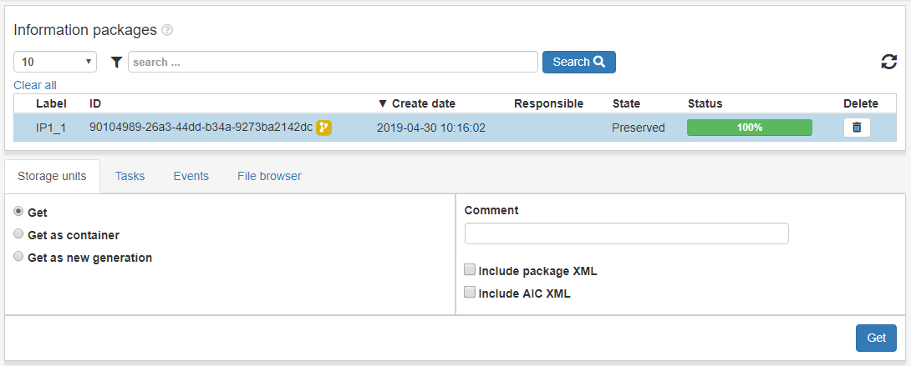

.. _access-search:
*******
Sök
*******

Access innehåller alla **arkiverade** AIPer.
Vi kan information som vanligt i de olika vyerna.

När man klickar ett IP i denna vy så får man se ett request-formulär.
Tillgängliga request förklaras nedan

.. _access-requests:

Request
=======

För att göra ett request/förfrågan välj vilken typ av förfrågan,
fyll i nödvändig information, markera **Förfrågan godkänd** och
klicka **Skicka**.

Hämta
-----

Hämta AIP extraherad som read_only till Åtkomst/arbetsyta

Välj alternativet **Hämta** Fyll i önskad information, markera
**Förfrågan godkänd** och klicka på **Skicka**.
Progressen kan följas i status-fältet flr IPt eller i större detalj
om man klickar på **Tillstånd**-fältet. Se
:ref:`State-vyn <user-interface-state-view>` för mer information.

.. image:: images/access_request_form_get.png

Hämta som container
-------------------
Access AIP in archival storage to the Access Workspace as
a tar or zip file.
Hämta AIP som tar eller zip-fil till Åtkomst/arbetsyta

Välj alternativet **Hämta som container** Fyll i önskad information, markera
**Förfrågan godkänd** och klicka på **Skicka**.
Progressen kan följas i status-fältet flr IPt eller i större detalj
om man klickar på **Tillstånd**-fältet. Se
:ref:`State-vyn <user-interface-state-view>` för mer information.

.. image:: images/access_request_form_get_as_container.png

Hämta som ny generation
---------------------
Hämta ip till Åtkomst/arbetsyta som en ny generation.
Den nya generationen är i princip ett helt eget IP, den är
bara relaterad till sina tidigare och senare generationen genom samma AIC.

Välj alternativet **Hämta som   ny generation** Fyll i önskad information, markera
**Förfrågan godkänd** och klicka på **Skicka**.
Progressen kan följas i status-fältet flr IPt eller i större detalj
om man klickar på **Tillstånd**-fältet. Se
:ref:`State-vyn <user-interface-state-view>` för mer information.

