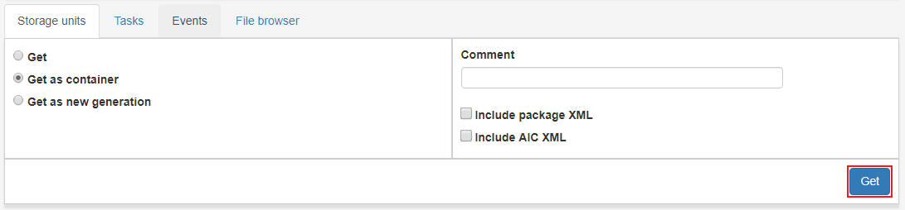

.. _access-search:
*******
Search
*******

Access is where all **preserved** AIPs are listed.
We can see information like events and steps/tasks of the preserved AIP.

When clicking a row in the Access list view the user may make request from
a request form. The available requests in Access are explained below.

.. image:: images/access_request_form.png

.. _access-requests:

Requests
========

To make a request click the desired request type, fill in the
required information, check the **Request approved** checkbox and click the **Submit** button.

Get
---
Access AIP in archival storage to the Access Workspace with
content extracted as read only.

Choose the option **Get**, enter a value in the
**purpose** field and click **Submit**. The AIP generation should
appear in the Access workspace shortly, the progress can be followed
in the status bar of the IP and in the
:ref:`State view <user-interface-state-view>` for more detailed information.

Get as container
----------------
Access AIP in archival storage to the Access Workspace as
a tar or zip file.

Choose the option **Get as container**, enter a value in the
**purpose** field and click **Submit**. The AIP generation should
appear in the Access workspace shortly, the progress can be followed
in the status bar of the IP and in the
:ref:`State view <user-interface-state-view>` for more detailed information.

Get as new generation
---------------------
Access AIP in archival storage to the Access Workspace as a
new generation of the AIP.
The new IP is basically a whole new IP but it is still related to the
family of IPs that are related to the same AIC.

Choose the option **Get as new generation**, enter a value in the
**purpose** field and click **Submit**. The AIP generation should
appear in the Access workspace shortly, the progress can be followed
in the status bar of the IP and in the
:ref:`State view <user-interface-state-view>` for more detailed information.

.. image:: images/access_request_form_get_as_new.png
