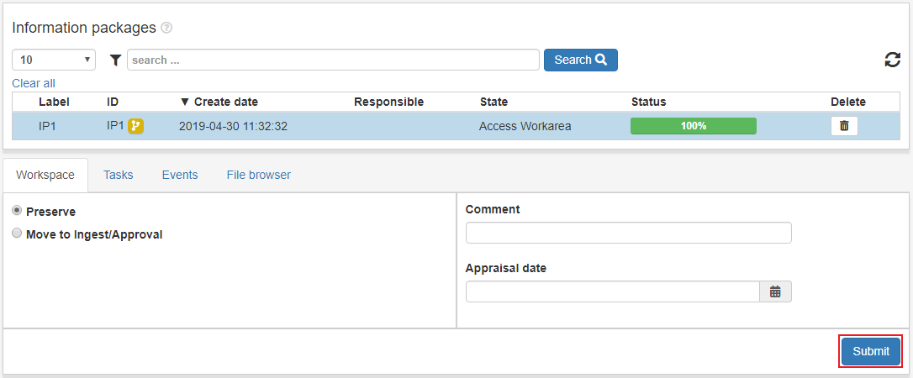
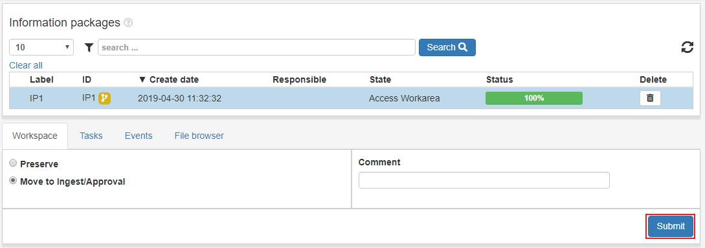

.. _access-workspace:

****************
Access Workspace
****************
Åtkomst/arbetsyta
En arbetsyta där man kan modifera ett IP genom gränssnitt eller
tredjepartsverktyg. Arbetsytor är privata och olika för olika användare.

IPn i Åtkomst/arbetsyta är tillgängliga under :ref:`utlämnande <dissemination>`
 som en del av ett utlämnande.

När ett IP har blivit hämtat till Åtkomst/arbetsyta kan man
arkivera det direkt eller **flytta till Mottagande/godkännande**

För att arkivera ett IP klicka på IPts rad.
Välj alternativet **Arkivera** Fyll i önskad information, markera
**Förfrågan godkänd** och klicka på **Skicka**.
Progressen kan följas i status-fältet flr IPt eller i större detalj
om man klickar på **Tillstånd**-fältet. Se
:ref:`State-vyn <user-interface-state-view>` för mer information.

För att flytta IP till :ref:`mottagande/godkännande <approval>` klicka
på IP-raden välj **Flytta till mottagande/godkännande** och klicka **Skicka**.

