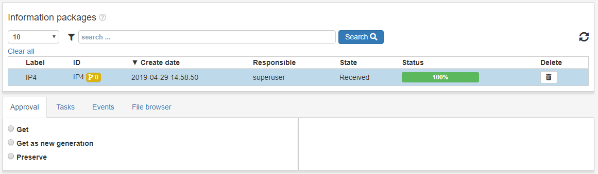
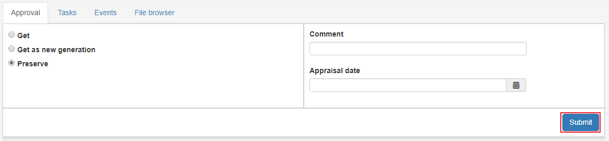
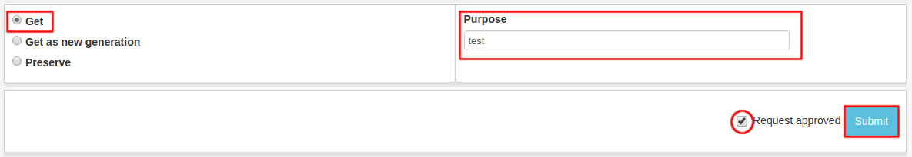
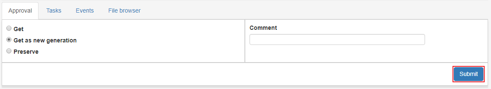

.. _approval:

**********
Approval
**********

IP Approval is the place of EPP where AIPs are before they are preserved.
The purpose of the Approval page is to check if he AIP is approved for
preservation to the archive.

When clicking a AIP in the Approval list view we see
a request form, which simply is a form for different actions on a AIP.
There are a couple of different types of request which are explained below

.. _approval-requests:

Requests
========

Preserve
--------

Peserve AIP to archival storage according to information from profiles.

Choose the option **Preserve**, enter a value in the **purpose** field
and click **Submit** and the preservation process of the AIP has begun.
The progress can be followed in the status bar of the IP and in the
:ref:`State view <user-interface-state-view>` for more detailed information.

Get
---

Get AIP to Ingest Workspace as `read only`.
That means that the IP in workspace can not be changed, only "read".

Choose the option **Get**, enter a value in the **purpose**
field and click **Submit**. The AIP will appear in ingest workspace shortly.
The progress can be followed in the status bar of the IP and in the
:ref:`State view <user-interface-state-view>` for more detailed information.

Get as new generation
---------------------

Get IP to Ingest Workspace as a new generation of IP.
The new IP is basically a whole new IP but it is still related to the
family of IPs that are related to the same AIC.

Choose the option **Get as new generation**, enter a value in the
**purpose** field and click **Submit**. The AIP generation should
appear in the ingest workspace shortly, the progress can be followed
in the status bar of the IP and in the
:ref:`State view <user-interface-state-view>` for more detailed information.

