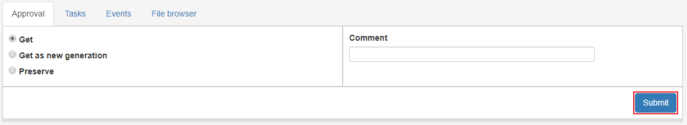

.. _approval:

**********
Approval
**********

Godkännande är där AIPer hamnar innan dom ska arkiveras.
poängen med sidan är att kolla att AIPn uppfyller de krav en användare kan ha
innan den arkiveras.

När man klickar på ett IP i listvyn får vi fram ett "request-formulär"
som är ett formulär där man kan välja att utföra vissa aktioner på en AIP.
Typer på dessa request är beskrivna här nedan.

.. _approval-requests:

Request
========

Arkivera
--------

Arkivera AIP till archival storage enligt information från profiler.

Välj alternativet **Arkivera** Fyll i önskad information, markera
**Förfrågan godkänd** och klicka på **Skicka**.
Progressen kan följas i status-fältet flr IPt eller i större detalj
om man klickar på **Tillstånd**-fältet. Se
:ref:`State-vyn <user-interface-state-view>` för mer information.

.. image:: images/request_form_preserve.png

Hämta
-----

Hämtar en AIP som `read only` vilket betyder att den inte kan ändras.
IPt kommer då att dyka upp under mottagande/arbetsyta

Välj alternativet **Hämta** Fyll i önskad information, markera
**Förfrågan godkänd** och klicka på **Skicka**.
Progressen kan följas i status-fältet flr IPt eller i större detalj
om man klickar på **Tillstånd**-fältet. Se
:ref:`State-vyn <user-interface-state-view>` för mer information.

Hämta som ny generation
-----------------------

Hämta ip till mottagande/arbetsyta som en ny generation.
Den nya generationen är i princip ett helt eget IP, den är
bara relaterad till sina tidigare och senare generationen genom samma AIC.

Välj alternativet **Hämta som ny generation** Fyll i önskad information, markera
**Förfrågan godkänd** och klicka på **Skicka**.
Progressen kan följas i status-fältet flr IPt eller i större detalj
om man klickar på **Tillstånd**-fältet. Se
:ref:`State-vyn <user-interface-state-view>` för mer information.

.. image:: images/request_form_get_as_new.png
