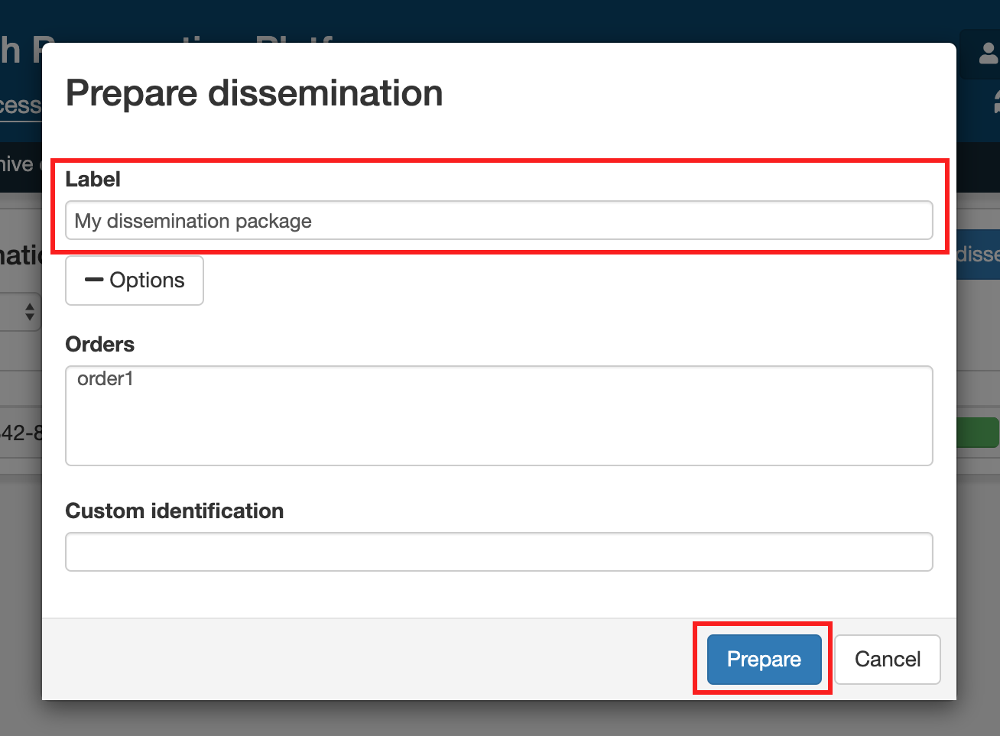
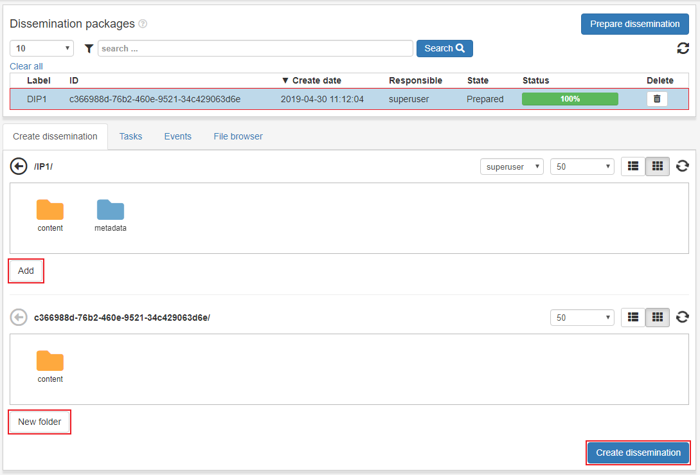

.. _dissemination:

*************
Utlämnande
*************

Syftet med utlämnande-sidan är att skapa utlämnanden(disseminations eller DIP).
Allt material som ligger under Åtkomst/arbetstya är tillgängligt
för ett utlämnande.

Första steget är att förbereda ett utlämnande.
Klicka på **Förbered utlämnande**. Fyll i label och resterande
fält om så önskas(ej obligatoriska). Man kan även koppla utlämnande
till en beställning, då kan vi se utlämnandet och dess filer
när vi klickar på en beställning. Klicka **ok** när
utlämnande-paket är klart.

Klicka ett utlämnande för att få upp två filhanterare.
den första innehåller all data från åtkomst/arbetsyta och den nedre
är själva utlämnandet.
Markera en fil eller mapp i den övre och klicka **lägg till**.
En användare kan även ta bort filer från utlämnandet och skapa nya mappar.

När man är klar med ett utlämnande klickar man i **Godkänd för att skapa**
och klickar på **Skapa utlämnande**.

