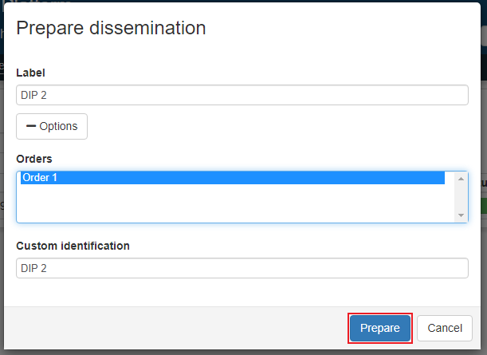

.. _dissemination:

*************
Dissemination
*************

The purpose of the Dissemination page is creating disseminations(or DIP).
The content of every IP that is present in Access workspace is available
in the dissemination page and can be used to create a dissemination.
A dissemination package is an IP for handing to a customer, also called DIP.

First step is to prepare dissemination, so click **Prepare dissemination**.
Enter the only required field label, optionally enter a custom
identification value and connect dissemination to order.
Then click **ok** and the dissemination package has been prepared.

Click the DIP row in the list view and two filebrowsers will appear.
The first represents data in workspace which can be marked and added to
the second filebrowser window by clicking **Add**.
The user can also add new folders in the DIP and remove added files/folders.

When satisfied with dissemination check the **Approved to create** checkbox
and click **Create dissemination**.

.. image:: images/create_dip.png
