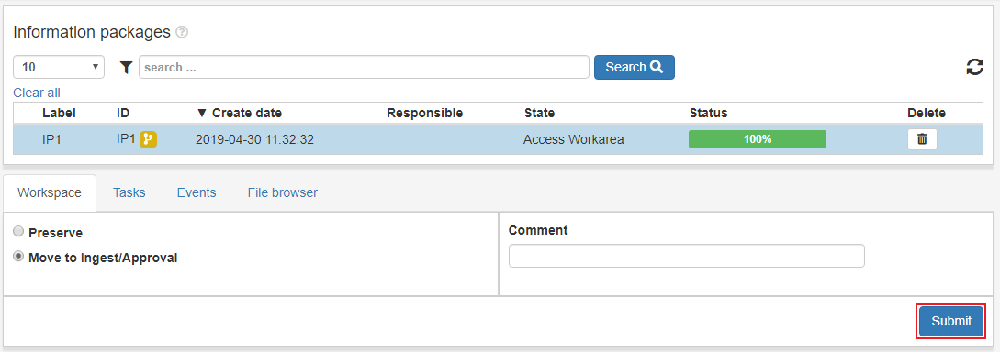

.. _ingest-workspace:

****************
Ingest Workspace
****************

The Ingest Workspace is where the user can modify IPs both in the user
interface and access the files to use 3rd party tools.
Workspaces are private and can be different for each user.

When an IP is done in the workspace it can be clicked and can be
**Preserved** right away or **Moved to ingest/approval**.

To preserve an IP click the IP's row in the list view table.
Select the **Preserve** option, enter a value in the **purpose** field
and click **Submit**.
The progress can be followed in the status bar of the IP and in the
:ref:`State view <user-interface-state-view>` for more detailed information.

.. image:: images/request_form_workspace_preserve.png

To move an IP to :ref:`Ingest/Approval <approval>`, click the IP row in the
list view table. Select the option **Move to ingest/approval**, enter a value in
the **purpose** field and click **Submit**.

