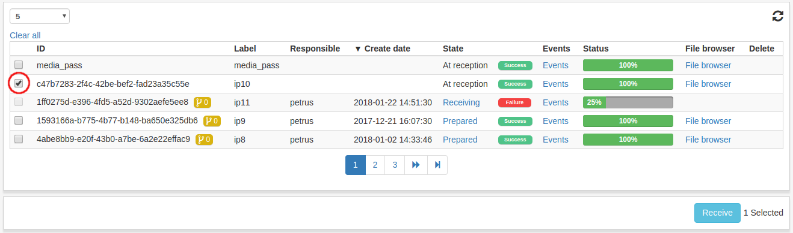
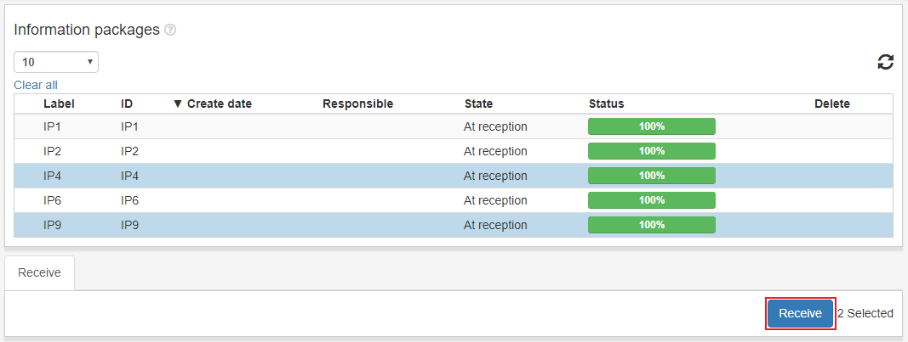
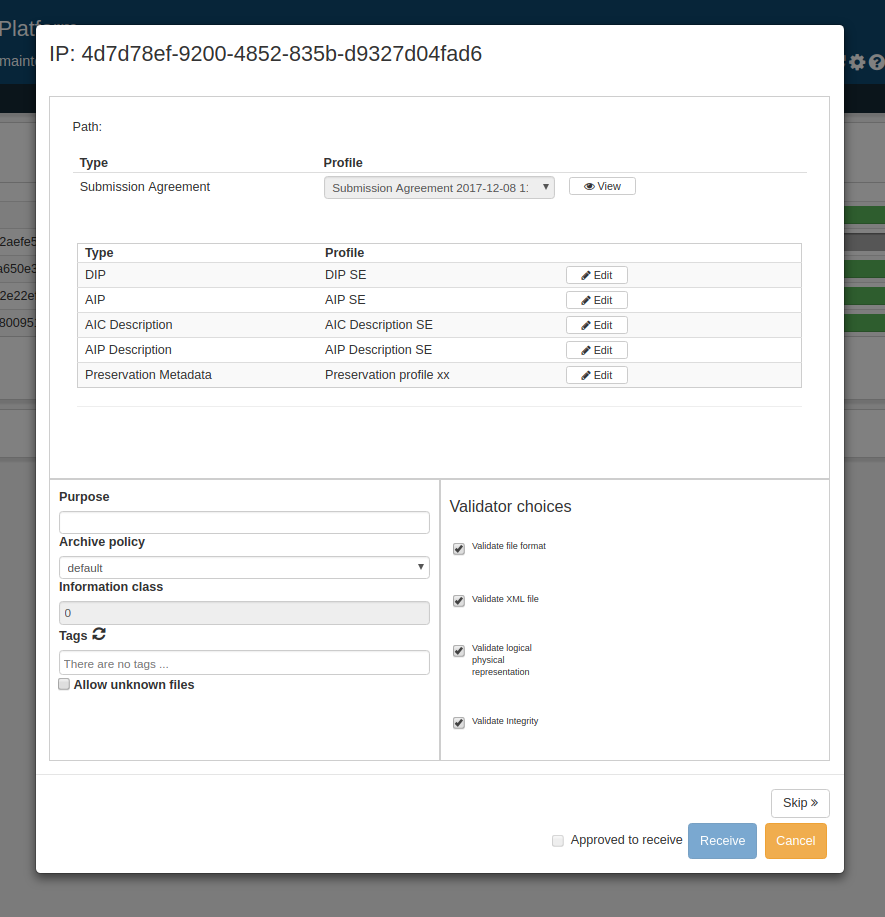
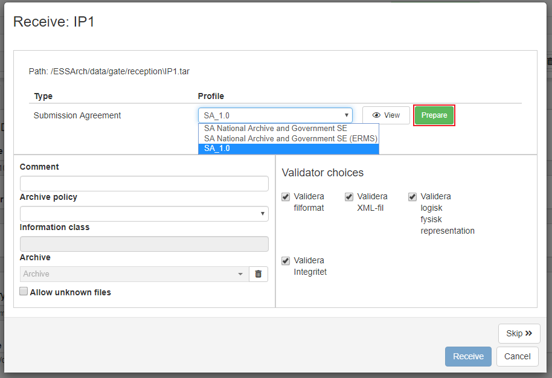
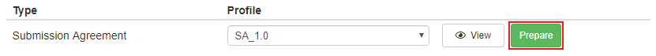
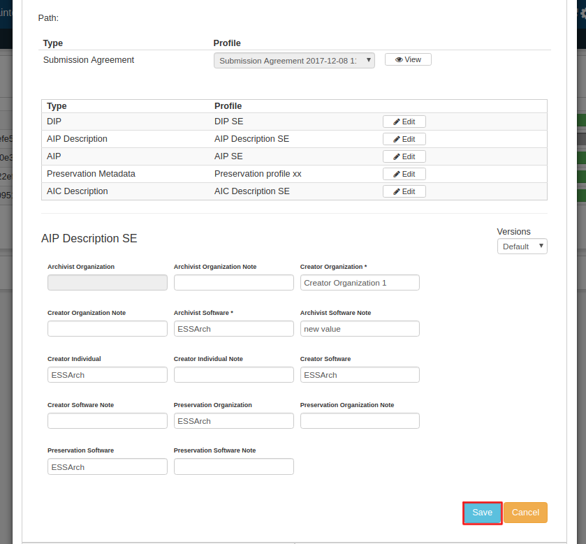
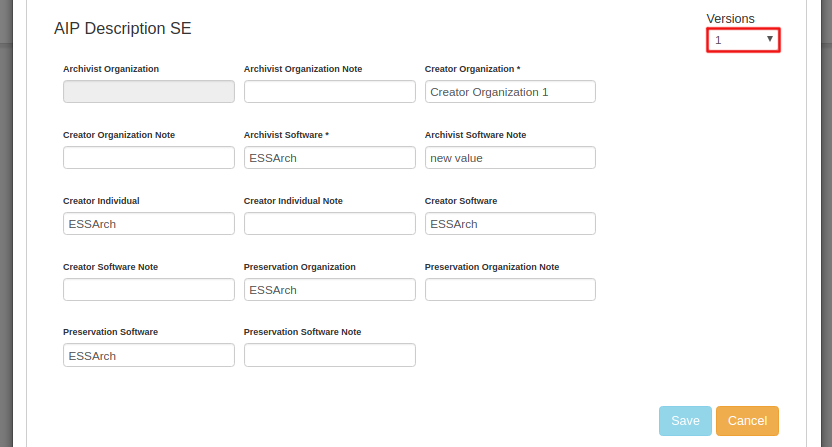

.. _reception:

*********
Reception
*********

.. _receive-sip:

Ta emot SIP
===========
För att ta emot ett IP, kryssa i kryssrutan för respektive IP som ska tas emot.
Flera IP:n kan valjas samtidigt.

När IP:n har valts klicka på knappen **Ta emot** längst ner i högra hörnet.

När knappen väl klickats kommer ett nytt fönster att öppnas för att ta emot det
första valda IP:t.

Profileditor
--------------
Använd rullistan för att välja vilken leveransöverenskommelse som ska användas,
klicka sedan på **Förbered**.
Om rullistan är inaktiverad, har IPt redan en koppling till
leveransöverenskommelsen.

I profileditorn kan en användare editera data i en profil för ett specifikt IP.
Data-fälten för en leveransöverenskommelse kan bara läsas genom
att klicka på **Visa**-knappen bredvid rullistan.

Under raden för leveransöverenskommelse finns alla relevanta profiler listade.
Klicka på **Redigera** för att redigera profil-data för IPt
som ska tas emot. Klicka sedan **Spara** när editeringen är färdig.

När man sparar profil-data så sparas alla tidigare versioner av datat
och kan väljas i version-rullistan. Völj mellan versioner och klicka
**Spara** för att spara.

Detta kan göras på alla profiltyper. Kom ihåg att spara datat så
det inte går förlorat.

Ta emot
-------

När leveransöverenskommelse och profiler är klara.
Fyll i alla obligatoriska fält, markera **Godkänd för att ta emot** och
klicka **Ta emot SIP**.
IPt börjar tas emot och om fler IPn valts kommer ett fönster för
nästa IP att dyka upp. Man kan skippa att ta emot ett IP genom att
klicka på **Hoppa över**.

.. image:: images/receive.png

När ett IP har tagits emot kan det inte längre hittas i receptionen,
den ligger istället under :ref:`Godkännande <ingest-ip-approval>`.
