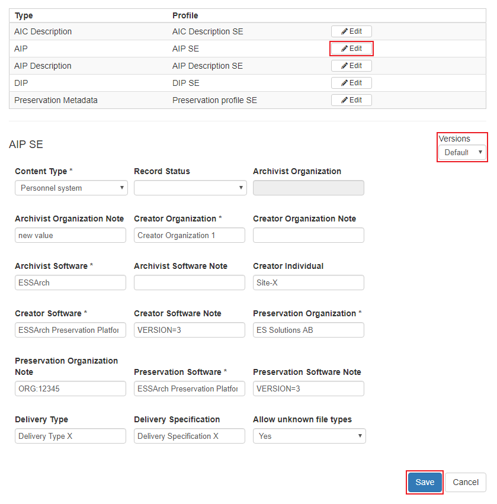
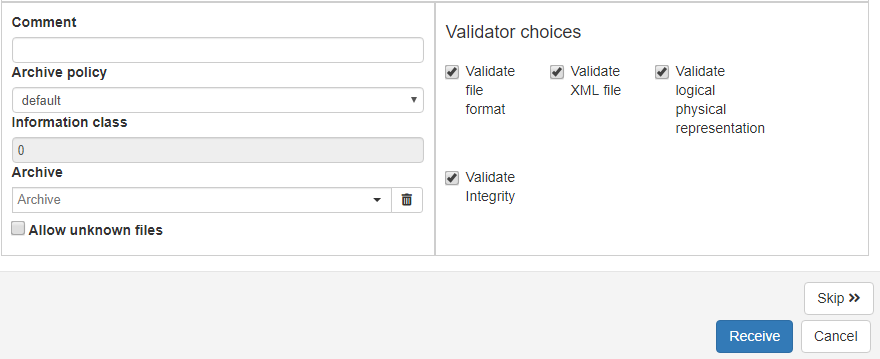

.. _reception:

*********
Reception
*********

.. _receive-sip:

Receive SIP
===========

To receive an IP, first select one IP by clicking the IP row in the list, or
mark multiple packages by either holding the :kbd:`CTRL` key and selecting each
IP or select the first IP, hold the :kbd:`SHIFT` key and select another to select
all IPs between including the two selected.

To select all visible IPs use the **Select all** option.

When desired IPs are included click the **Receive**-button in the
bottom right corner.

.. image:: images/reception_receive_button.png

Clicking the **Receive**-button will open a window to receive the first
included IP.

Profile Editor
--------------

Use the select dropdown to choose what submission agreement to use,
then click **Prepare**.
If the dropdown is disabled, the IP already has a related Submission agreement.

.. image:: images/profile_editor_select_sa.png

The profile editor is where the user can edit data of a profile for a specific IP.
The Submission agreements data fields can only be viewed by clicking
the **view** button next to the SA dropdown.

Underneath the Submission agreement row, all relevant profiles are listed.
Click **edit** next to a profile to edit the data of the profile for the
IP to be received.
When satisfied with the edit click **Save**.

When saving profile data, the previous versions are still available in the
version dropdown. Choose between data versions and click save to apply.

This can be done on each profile type, remember to save the data before
closing the profile form.

Receive
-------
To receive an IP it needs to be placed in an archive and a structure so that
the IP and its content is indexed can be found on the search page.
First select archive, then structure and last structure unit, which is
where we will find the IP in the search result tree structure.

When satisfied with submission agreement and profiles,
select an **Archive policy** and click **Receive**.
The process of receiving the IP is started and if more IPs are included a
receive window for the next IP will appear.
An IP can be skipped by clicking the **Skip**-button,
then the receive window for the next included IP will appear,
if there is one.

When IP is received it is no longer visible in the reception list view and
can be found in the :ref:`Approval <ingest-ip-approval>` section
